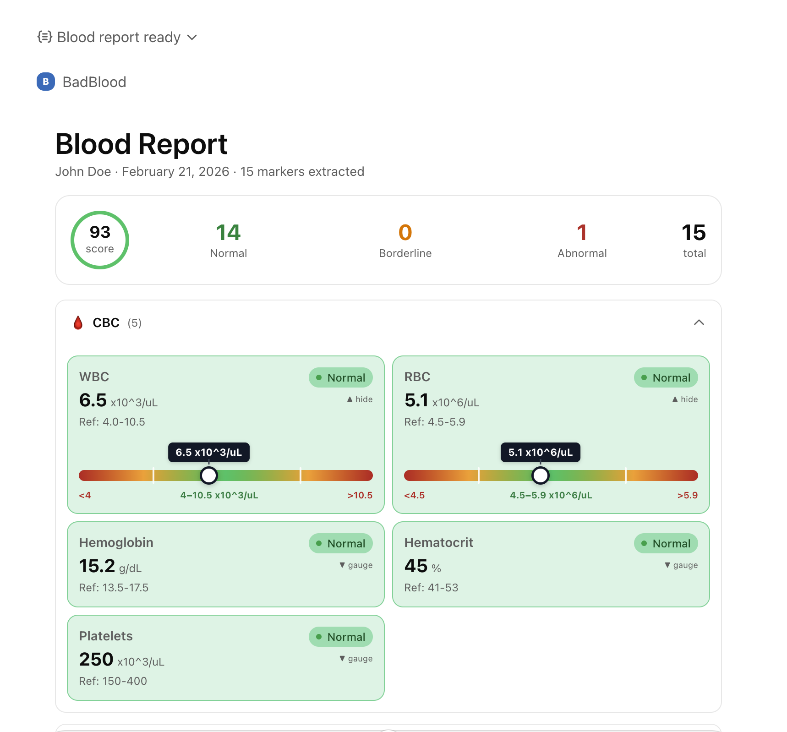
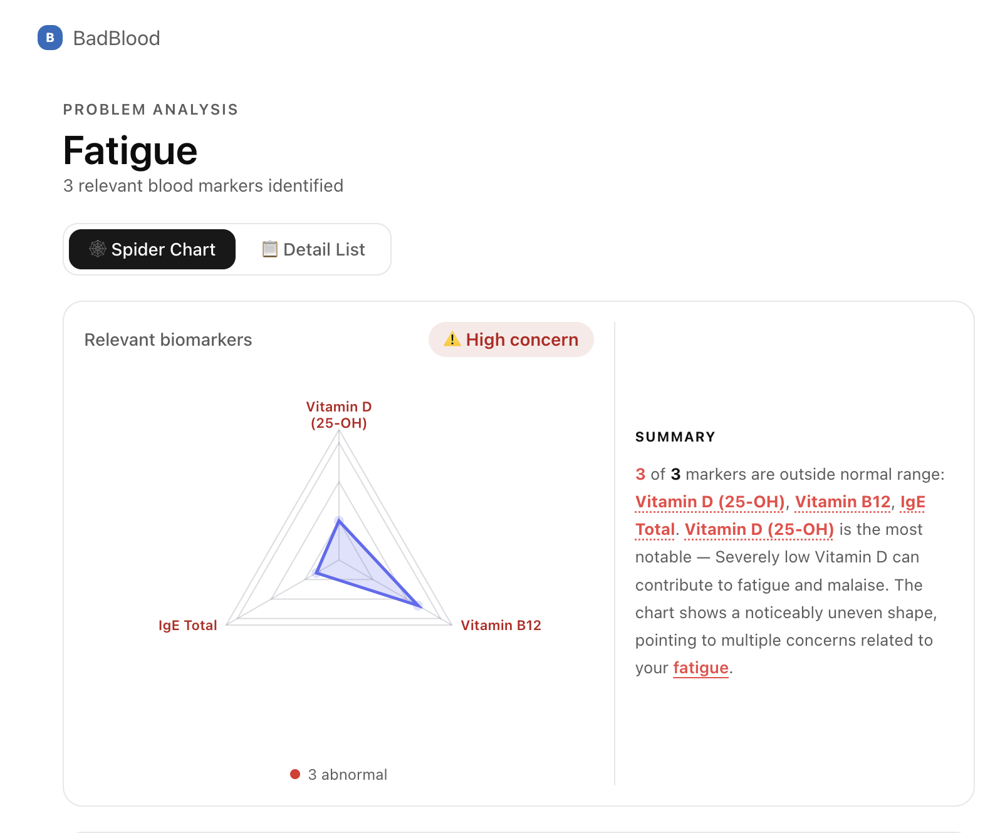

# 🩸 BadBlood 

> *"‘Cause, baby, now we got bad blood. You know it used to be mad love."* — Taylor Swift

**The future of patient-centric health intelligence.**

The current standard of patient lab reporting is fundamentally broken. When patients receive a pathology report, they are handed a sterile, 14-page PDF filled with chemical jargon—"Alanine Aminotransferase," "Eosinophils," "Creatinine." It is terrifying, confusing, and ultimately useless to the average person. 

Patients don't want raw data. They want to know: *How is my Liver? How is my Heart? Am I okay?*

Every year, billions of lab tests are performed globally, yet the delivery of these results remains stuck in the 1990s. This comprehension gap creates massive inefficiencies in the healthcare system, leading to heightened patient anxiety and wasted physician consultation time explaining basic data rather than discussing actionable treatment plans.

## 🕷️ The Vision: The Interface for Human Biology

BadBlood is not just a translation layer; it is a **completely new interface for human biology**. We take the antiquated, hard-to-read wall of data and transform it into a living, intuitive map of a patient's biological state. 

We are turning raw, intimidating diagnostic data into proactive health management.

### 🤖 The Unfair Advantage: Native AI Integration via MCP

Building another standalone health portal or app is a losing battle. Patients do not want yet another login.

BadBlood is built from the ground up as a **Model Context Protocol (MCP) server**. This is our trojan horse. By functioning as an MCP server, BadBlood injects its intelligence directly into the AI assistants patients *already* use and trust—like **ChatGPT** and **Claude**. 

**Zero friction. Zero new downloads. Maximum accessibility.**

---

## 🚀 How It Works (The Product Flow)

### Phase 1: Zero-Friction Ingestion & Instant Visualization

The patient uploads a standard, messy lab report PDF (from Quest Diagnostics, LabCorp, etc.) directly into their favorite AI chat window.

*(Example: A clean UI showing the transformation into a beautiful, personalized health report)*
<p align="center">
  
</p>

Immediately, BadBlood's extraction engine parses the unstructured data and normalizes the chaotic biomarkers into five core physiological systems:
- ❤️ **Cardio:** LDL, HDL, Triglycerides
- 🩸 **Hepatic (Liver):** AST, ALT, Bilirubin
- 🚰 **Renal (Kidneys):** BUN, Creatinine
- 🛡️ **Immune:** WBC, Eosinophils, Monocytes
- 🔋 **Metabolic:** Glucose, Iron, Vitamin D, TSH

The output is immediate: a dynamic **"Spider Chart"** visual health map. Center (0) is optimal health; outer edges (10) indicate systemic risk. Without a medical degree, a patient instantly sees if their "Heart" or "Energy" quadrant is spiking out of range. 

### Phase 2: Contextual Intelligence

BadBlood acts as an intelligent, empathetic health advocate. Based on the data anomalies detected during ingestion, it initiates a hyper-targeted dialogue.

*Example scenario: "Your liver and lipid panels are flagging outside optimal zones. Are you experiencing any physical symptoms right now, like chronic fatigue, joint pain, or brain fog?"*

### Phase 3: Actionable Patient Empowerment (The "Doctor's Briefing")

When the patient provides context (*"Yes, I'm exhausted every afternoon and have stomach issues"*), the engine cross-references the raw clinical data with the reported symptoms.

BadBlood then generates a **Doctor's Briefing**—a concise, formatted summary correlating their physical symptoms to their out-of-range clinical data. It provides the patient with the specific, necessary questions they must ask their physician at their next visit. 

*(Example: The context-aware output showing actionable insights on markers of concern)*
<p align="center">
  
</p>

---

## 📈 The Business Case & Market Opportunity

We are targeting a massive, unaddressed intersection in consumer health and generative AI.

1. **Massive TAM:** The global clinical laboratory services market is massive, yet the *patient experience* layer is entirely neglected.
2. **B2C Distribution Strategy (Freemium):** We utilize the viral, low-friction nature of MCP tools. Basic extraction and visualization are free, driving rapid user adoption via ChatGPT/Claude plugin ecosystems.
3. **B2B Licensing Potential:** Telehealth providers, modern clinics, and forward-thinking EHR systems desperately need to improve patient engagement. BadBlood's translation layer can be white-labeled via our API to vastly improve standard patient portals.

---

## 🛠️ The Technology (Under the Hood)

BadBlood is built on a scalable, modular architecture powered by the mcp-use framework and LLMs.

1. **Extraction Engine:** Seamlessly ingests and structures complex, unstructured PDF data.
2. **Translation/Scoring Layer:** Normalizes values across disparate metrics (mg/dL vs U/L) to calculate a unified "Risk Score" (0-10) for each physiological system.
3. **Dynamic Visualization:** Outputs strict JSON payloads to instantly render intuitive Radar/Spider Charts on the frontend, rejecting complex standalone app development in favor of pure, data-driven visualization injected into chat interfaces.

```json
{
  "chartConfig": {
    "type": "radar",
    "title": "BadBlood: Systemic Risk Map"
  },
  "data": [
    { "system": "Heart (Cardio)", "riskScore": 8 },
    { "system": "Liver (Hepatic)", "riskScore": 2 },
    { "system": "Kidneys (Renal)", "riskScore": 1 },
    { "system": "Immunity (WBC)", "riskScore": 3 },
    { "system": "Energy (Metabolism)", "riskScore": 7 }
  ]
}
```

---

## 💻 Technical Documentation

For technical implementation details, local execution, and MCP integration guidelines, please review our [Developer Guide](dev.md).
