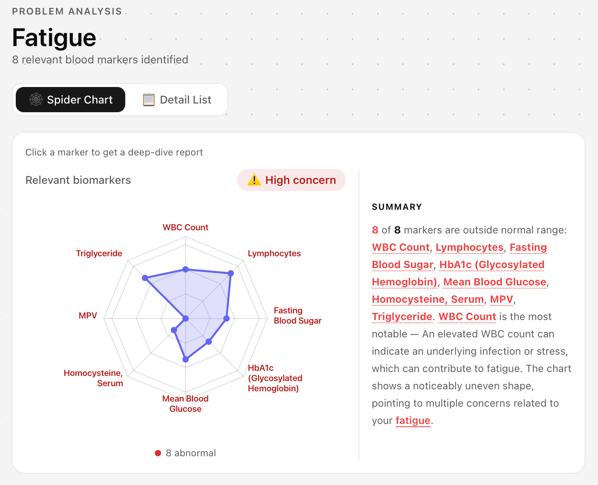
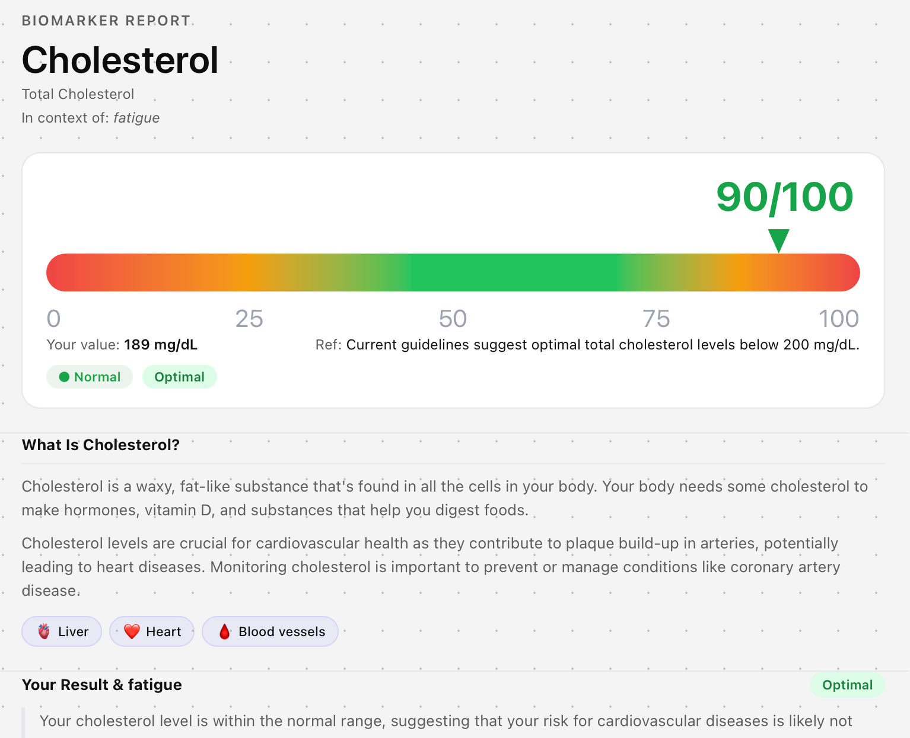
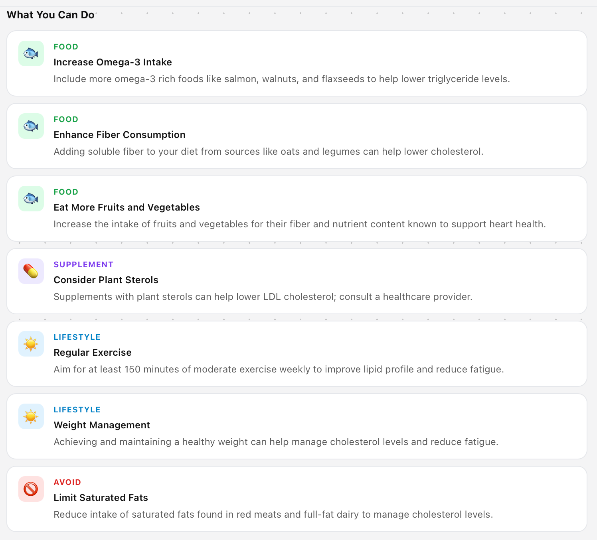
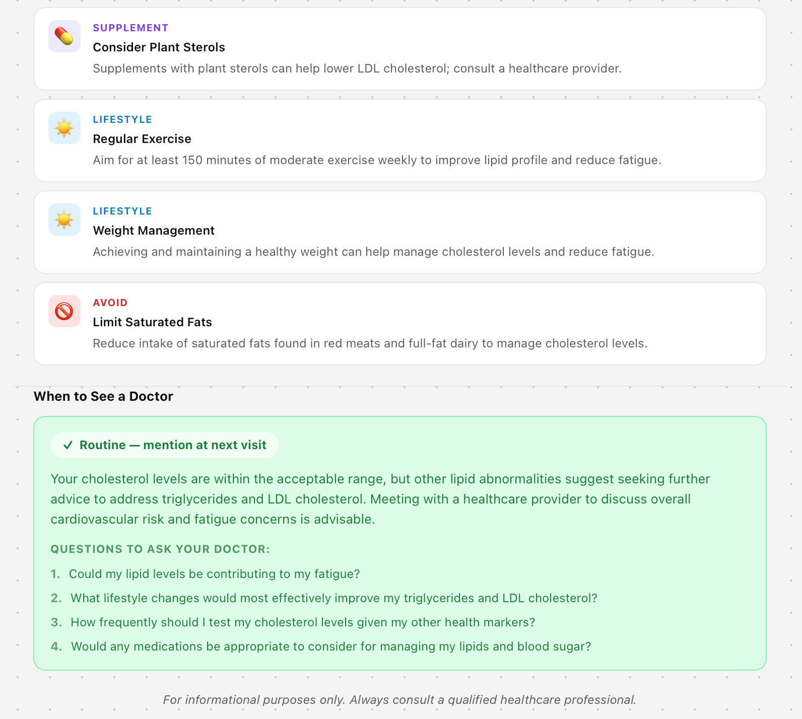

# 🩸 BadBlood 

> *"‘Cause, baby, now we got bad blood. You know it used to be mad love."* — Taylor Swift

**The Problem**  
You get your blood report back from the doctor, and you have no idea what high triglycerides mean, what low vitamin D means, or what high WBC means. You just get confused and anxious.

*What does that matter to me?*  
*Why am I always so exhausted?*  
*Why does my stomach hurt?*

You don't want a chemistry lesson when you feel like crap. You want answers. But instead, you get hit with a 14-page PDF of chemical jargon that makes everything worse.

We built BadBlood so you can finally **correlate how you feel with what your medical report says.**

---

## What BadBlood actually does

We currently focus on two main features to make your lab data truly actionable:

### 1. Problem Analysis (The Spider Chart)
Tell BadBlood how you feel. *"I'm exhausted every afternoon"* or *"My joints ache."*

  

No more Googling "high WBC causes" at 2 AM. You instantly see a clear visual of your health issues.

### 2. The Biomarker Report
Once you see *which* markers are causing your symptoms, you need to understand *what to do* about them. Our Biomarker Report gives you a comprehensive, human-readable deep-dive into any single metric.

#### The Big Picture

  

#### Details & Causes

  

#### What You Can Do

  

It tells you:
- **Where you stand:** A simple 0-100 gauge showing how optimal (or abnormal) your level is.
- **The "Why":** An explanation of what the biomarker actually is, in plain English, and how it relates to the symptoms you reported.
- **Common Causes:** Simple lists of why it might be high or low.
- **Related Markers:** Other things in your blood report that are connected.
- **Your Action Plan:** Concrete, actionable steps you can control—foods to eat more of, supplements to consider, lifestyle changes, and exactly when to loop in a doctor.

---

## 🛠️ How to use BadBlood in ChatGPT

1. Go to [ChatGPT](https://chatgpt.com/)
2. Click on the Profile button in the top right corner
3. Click on "Settings" then "Apps"
4. Enter the URL of the BadBlood MCP Server
5. Click "Add"

### An Example Interaction

**You:** *"Please use BadBlood to analyze my report. Why am I exhausted every afternoon?"*

**BadBlood (via ChatGPT):** 
*Based on your report, I found several biomarkers out of normal range that could be contributing to your fatigue. Here is a visual breakdown of the markers most strongly correlated with your symptoms:*

  

*The chart shows a noticeably uneven shape, pointing to multiple concerns.*
*Would you like to deep-dive into any of these specific markers (like your elevated WBC Count or Triglycerides) to see what you can do about them?*

---

## 💻 Under the Hood & Developer Guide

BadBlood is built on a scalable, modular architecture powered by the mcp-use framework and LLMs. For technical specs, local execution, and MCP integration, please check out the [Developer Guide](dev.md).
